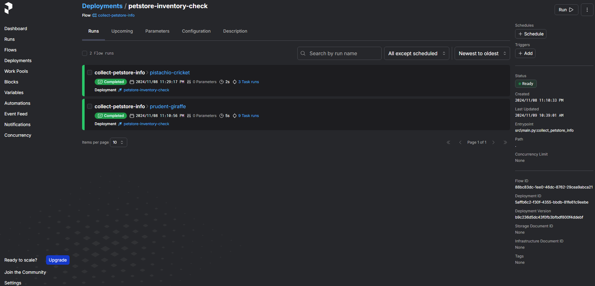
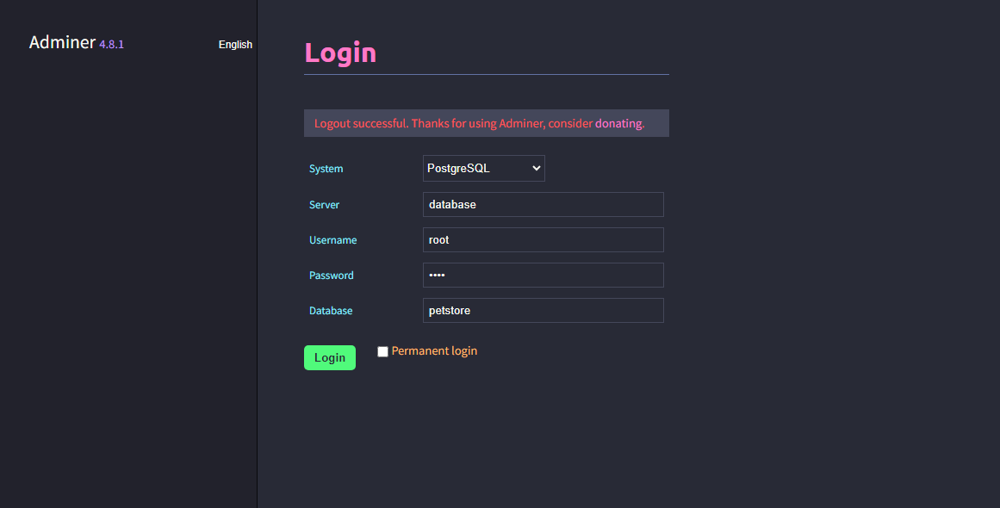
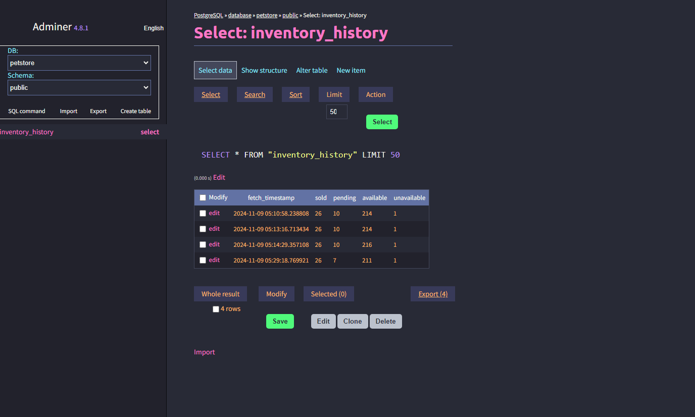

# Petstore Datapipeline using Prefect

This project is meant to showcase the use of Prefect as a pipeline orchestration tool using a simple Petstore example. Here is the simple flow of the project:

1. Get data using an online swagger api [Get Petstore Inventory](https://petstore.swagger.io/#/store/getInventory). This is a simple API that returns the status of inventory of a Petstore, whose API output looks something like this:

    ```json
    {
        "sold": 1,
        "Sold": 18,
        "string": 706,
        "Out Of Stock": 18,
        "pending": 5,
        "available": 172,
        "not available": 2,
        "Error": 53,
        "Available": 18
    }
    ```

2. As you can look from the JSON output, the output is not clean, and as a Data Engineer, you job is to create a data pipeline that will clean the data, and make it in a usable format. Here, we are only concerned with 4 kinds of status of the inventory: sold, pending, available and not available, rest we are not cencerned with. I have written a function that will clean the data using a `Prefect Task`.

3. Finally, once the data is clean, we will store the cleaned data along with its timestamp in a Postgres database running in a docker container, whose script has been provided in this git repo.

**So, TLDR:**

**Get Data from API -> Clean the Data -> Store it in a Postgres Database Table
And Orchestrate everything using Prefect**

## Folder Structure and file information:

**database/init/**: This folder contains the sql script to create a table in the postgres database running in the docker container. This script will only run only once for the docker container. If you stop and start the container, this script will not run again.

**src/**: Contains the prefect code to run all the tasks and flows.

**tests/**: Contains tests to test all the tasks used for the orchestration.

**docker-compose.yaml**: Script that will spin up a docker container running a postgres database, and will also spin up Adminer on port 8080, that we will use to view the postgres database and tables, and ofcourse the data.

**requirements.txt**: Run this to install all the dependencies associated with the project.

## How to run the code?

In the terminal, and assuming you created a virtual environment, run the following commands:

- This will spin up a docker container running postgres database, along with adminer. The postgres database has a username: root, password: root, database name: petstore and tablename: inventory_history.

    ```bash
    docker-compose up -d
    ```

- Installing all the dependencies:

    ```bash
    pip install -r requirements.txt
    ```

- Setting up Pre-Commit:

    ```bash
    pre-commit install
    ```

- Starting the Prefect Server:

    ```bash
    prefect server start
    ```

- Setting the Prefect API URL:

    ```bash
    prefect config set PREFECT_API_URL="http://127.0.0.1:4200/api"
    ```

- Once everything is running, you can view the prefect dashboard at:

    ```bash
    http://127.0.0.1:4200/dashboard
    ```

- Adminer can be found at:

    ```bash
    http://localhost:8080/
    ```

- To run the Prefect code, use this command. This will start up the agent that will be used to run the flow.

    ```bash
    python src/main.py
    ```

- To run the actual flow and see the results, you will need to go to the Prefect dashboard, go to Deployments, and find *petstore-inventory-check* deployment. Go inside this deployment and hit run on the top right, this will manually trigger your pipeline to run:

    

- Once the pipeline has been ran, you can go to Adminer to view the table and rows added:

    - Use this template to login into Adminer:

        

    - View the table to see the new rows added:

        

## Clean-Up:

- After you have finished running everything, you will need to run the following commands:

- Exit the Prefect Server
- Stop the docker container using:

    ```bash
    docker-compose down
    ```

## Future Improvements:

- Add tests for each task using Pytest, to make the pipeline more robust and less prone to any errors.